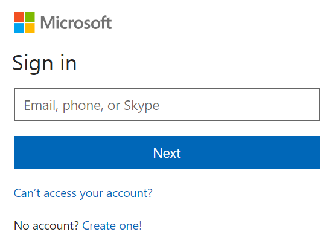

# ml-primer-in-azure-notebooks
Examples of python basics for Machine Learning entry in Azure Notebooks

https://notebooks.azure.com/

Browse at:

https://notebook.azure.com

Login with your Microsoft account

Click on My Project and next use Upload GitHub Repo

Fill  djkormo/ml-primer-in-azure-notebooks  as github repository

Click import and after a while

Please wait... Importing content from Git takes some time

Look at Status: Stopped

Click on Run on Free Compute

Status: Running on Free Compute 

Now we have our first Jupyter Notebook project

We can also use JupyterLab

Click with the right button no your project

And choose Run in JupyterLab

