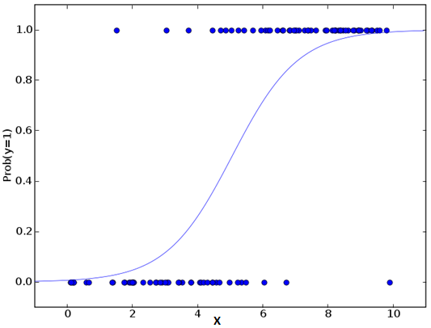

## Logistic Regression

Don’t get confused by its name! It is a classification not a regression algorithm. It is used to estimate discrete values ( Binary values like 0/1, yes/no, true/false ) based on given set of independent variable(s). In simple words, it predicts the probability of occurrence of an event by fitting data to a logit function. Hence, it is also known as logit regression. Since, it predicts the probability, its output values lies between 0 and 1 (as expected).

Again, let us try and understand this through a simple example.

Let’s say your friend gives you a puzzle to solve. There are only 2 outcome scenarios – either you solve it or you don’t. Now imagine, that you are being given wide range of puzzles / quizzes in an attempt to understand which subjects you are good at. The outcome to this study would be something like this – if you are given a trignometry based tenth grade problem, you are 70% likely to solve it. On the other hand, if it is grade fifth history question, the probability of getting an answer is only 30%. This is what Logistic Regression provides you.

Coming to the math, the log odds of the outcome is modeled as a linear combination of the predictor variables.

odds= p/ (1-p) = probability of event occurrence / probability of not event occurrence
ln(odds) = ln(p/(1-p))
logit(p) = ln(p/(1-p)) = b0+b1X1+b2X2+b3X3....+bkXk

Above, p is the probability of presence of the characteristic of interest. It chooses parameters that maximize the likelihood of observing the sample values rather than that minimize the sum of squared errors (like in ordinary regression).

Now, you may ask, why take a log? For the sake of simplicity, let’s just say that this is one of the best mathematical way to replicate a step function. I can go in more details, but that will beat the purpose of this article.

Build your own logistic regression model in Python here and check the accuracy:

https://www.youtube.com/watch?v=yIYKR4sgzI8

