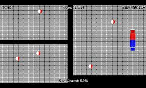

## Decision Tree

This is one of my favorite algorithm and I use it quite frequently. It is a type of supervised learning algorithm that is mostly used for classification problems. Surprisingly, it works for both categorical and continuous dependent variables. In this algorithm, we split the population into two or more homogeneous sets. This is done based on most significant attributes/ independent variables to make as distinct groups as possible. For more details, you can read: Decision Tree Simplified.

In the image above, you can see that population is classified into four different groups based on multiple attributes to identify ‘if they will play or not’. To split the population into different heterogeneous groups, it uses various techniques like Gini, Information Gain, Chi-square, entropy.

The best way to understand how decision tree works, is to play Jezzball – a classic game from Microsoft (image below). Essentially, you have a room with moving walls and you need to create walls such that maximum area gets cleared off with out the balls.

So, every time you split the room with a wall, you are trying to create 2 different populations with in the same room. Decision trees work in very similar fashion by dividing a population in as different groups as possible.

More: Simplified Version of Decision Tree Algorithms

https://www.youtube.com/watch?v=7VeUPuFGJHk

