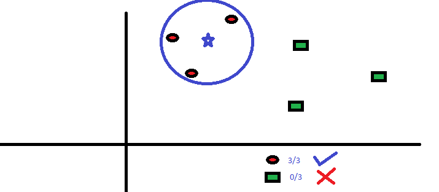

## kNN (k- Nearest Neighbors)

It can be used for both classification and regression problems. However, it is more widely used in classification problems in the industry. K nearest neighbors is a simple algorithm that stores all available cases and classifies new cases by a majority vote of its k neighbors. The case being assigned to the class is most common amongst its K nearest neighbors measured by a distance function.

These distance functions can be Euclidean, Manhattan, Minkowski and Hamming distance. First three functions are used for continuous function and fourth one (Hamming) for categorical variables. If K = 1, then the case is simply assigned to the class of its nearest neighbor. At times, choosing K turns out to be a challenge while performing kNN modeling.

More: Introduction to k-nearest neighbors : Simplified.

KNN can easily be mapped to our real lives. If you want to learn about a person, of whom you have no information, you might like to find out about his close friends and the circles he moves in and gain access to his/her information!

Things to consider before selecting kNN:

    KNN is computationally expensive
    Variables should be normalized else higher range variables can bias it
    Works on pre-processing stage more before going for kNN like an outlier, noise removal

https://www.youtube.com/watch?v=HVXime0nQeI

