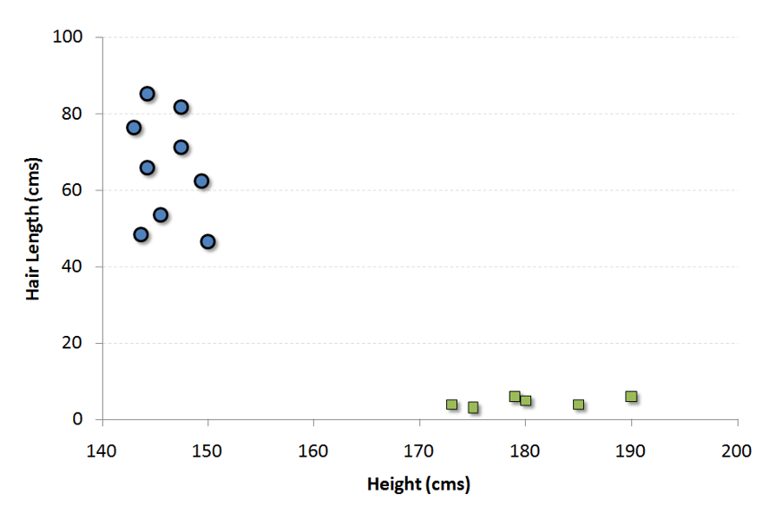
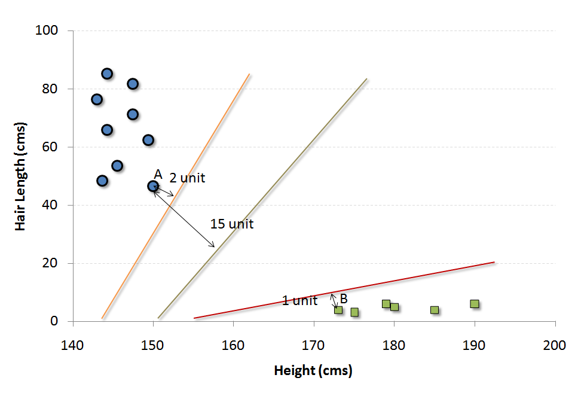

# SVM (Support Vector Machine)

It is a classification method. In this algorithm, we plot each data item as a point in n-dimensional space (where n is number of features you have) with the value of each feature being the value of a particular coordinate.

For example, if we only had two features like Height and Hair length of an individual, we’d first plot these two variables in two dimensional space where each point has two co-ordinates (these co-ordinates are known as Support Vectors)

Now, we will find some line that splits the data between the two differently classified groups of data. This will be the line such that the distances from the closest point in each of the two groups will be farthest away.

In the example shown above, the line which splits the data into two differently classified groups is the black line, since the two closest points are the farthest apart from the line. This line is our classifier. Then, depending on where the testing data lands on either side of the line, that’s what class we can classify the new data as.

More: Simplified Version of Support Vector Machine

Think of this algorithm as playing JezzBall in n-dimensional space. The tweaks in the game are:

    You can draw lines/planes at any angles (rather than just horizontal or vertical as in the classic game)
    The objective of the game is to segregate balls of different colors in different rooms.
    And the balls are not moving.

https://www.youtube.com/watch?v=efR1C6CvhmE