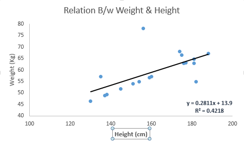

## Linear Regression

It is used to estimate real values (cost of houses, number of calls, total sales etc.) based on continuous variable(s). Here, we establish relationship between independent and dependent variables by fitting a best line. This best fit line is known as regression line and represented by a linear equation Y= a *X + b.

The best way to understand linear regression is to relive this experience of childhood. Let us say, you ask a child in fifth grade to arrange people in his class by increasing order of weight, without asking them their weights! What do you think the child will do? He / she would likely look (visually analyze) at the height and build of people and arrange them using a combination of these visible parameters. This is linear regression in real life! The child has actually figured out that height and build would be correlated to the weight by a relationship, which looks like the equation above.

In this equation:

    Y – Dependent Variable
    a – Slope
    X – Independent variable
    b – Intercept

These coefficients a and b are derived based on minimizing the sum of squared difference of distance between data points and regression line.

Look at the below example. Here we have identified the best fit line having linear equation y=0.2811x+13.9. Now using this equation, we can find the weight, knowing the height of a person.

Linear Regression is mainly of two types: Simple Linear Regression and Multiple Linear Regression. Simple Linear Regression is characterized by one independent variable. And, Multiple Linear Regression(as the name suggests) is characterized by multiple (more than 1) independent variables. While finding the best fit line, you can fit a polynomial or curvilinear regression. And these are known as polynomial or curvilinear regression.

Here’s a coding window to try out your hand and build your own linear regression model in Python:
